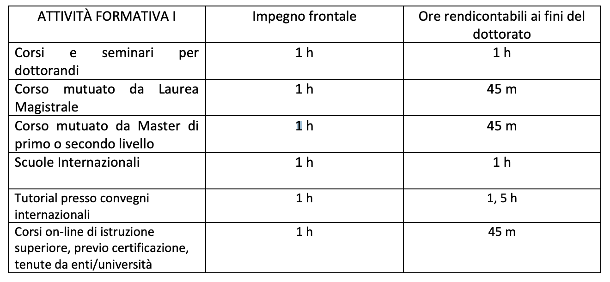

# Regulation

The Regulation in this repository is from 2019, use also your "PhD Call document" (Bando di dottorato) as official reference.

## PhD Annual activities

Every year a PhD student has to do 120 hours of activities, these hours includes the following activities according to the regulation:

